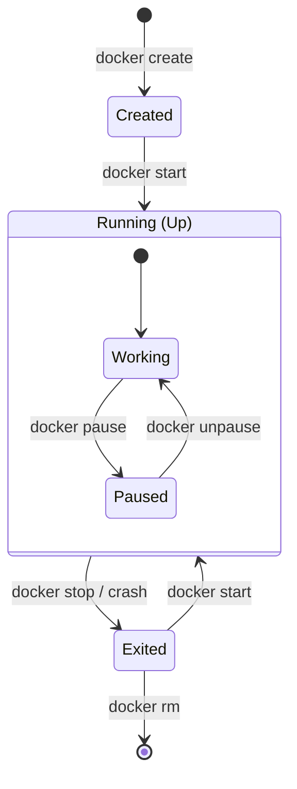
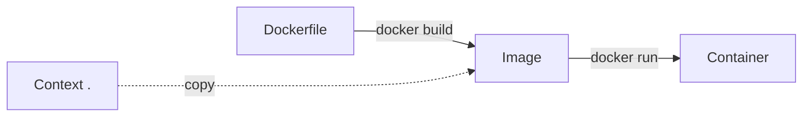
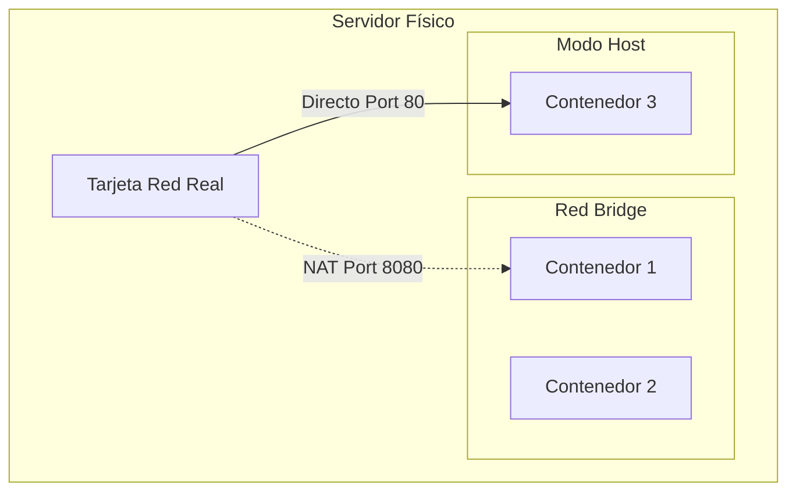
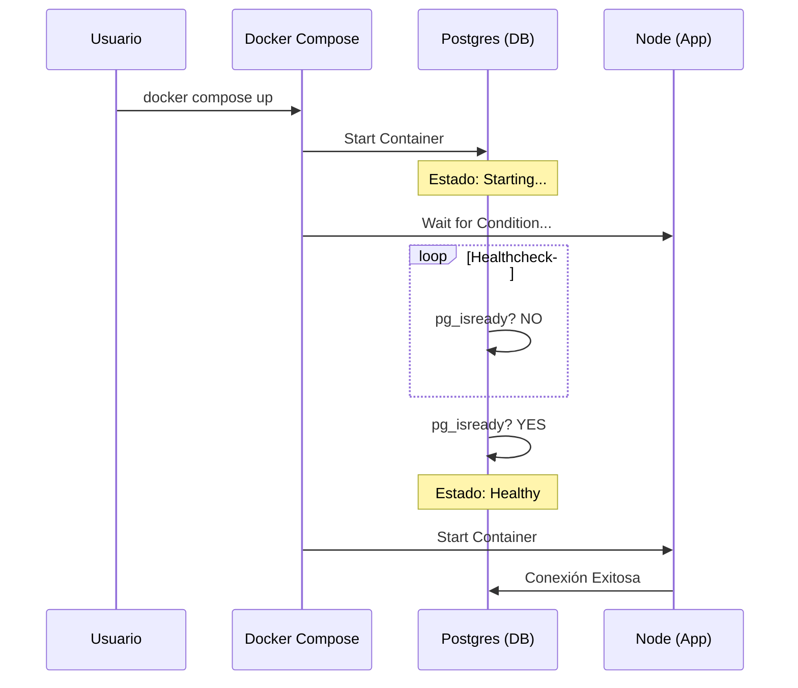
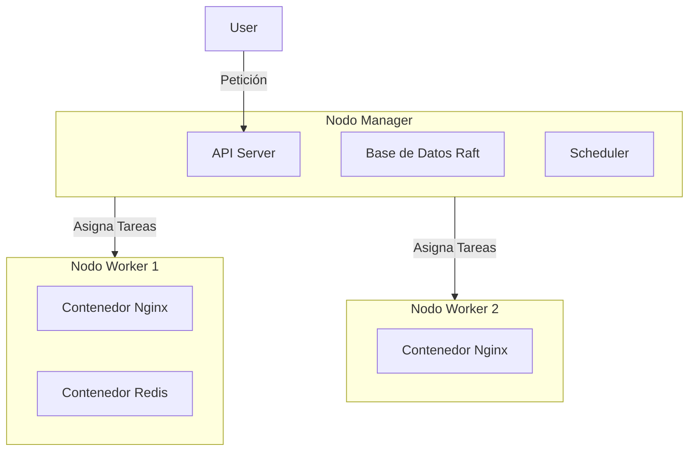
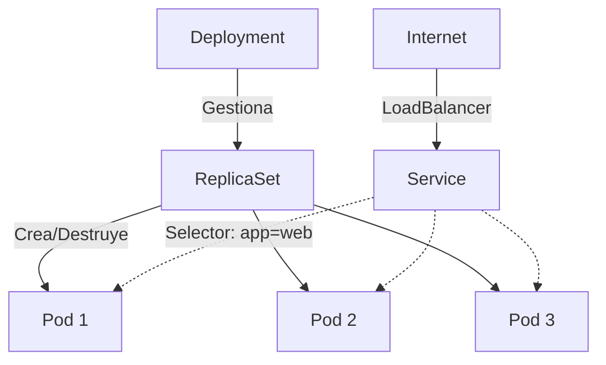

# Guía de Recursos Visuales del Curso Docker

Este documento contiene las especificaciones para los artefactos gráficos del curso.
Debido a límites de generación, las imágenes se definen por sus PROMPTS para ser generadas posteriormente.
Los diagramas se definen en código `Mermaid.js` listo para usar.

---

## Módulo 1. Fundamentos

### Imagen 1.1. VMs vs Contenedores
**Concepto**: Eficiencia y Recursos Compartidos.
**Referencia**: `modulos/modulo_1/tema_1_subtema_1_contenido.md`
**Prompt Sugerido**:
> "A split 3D infographic illustration comparison. Left side labeled 'Virtual Machines': Separate detached houses, each with its own heavy foundation and roof, representing isolation and heavy resources. Right side labeled 'Containers': A modern high-rise glass apartment building sharing a single strong foundation, representing efficiency and shared kernel. Clean aesthetic, isometric view, tech colors (blue, white, cyan), high quality render."

### Diagrama 1.2: Ciclo de Vida del Contenedor
**Concepto**: Estados y Comandos.
**Ubicación**: `modulos/modulo_1/tema_2_subtema_2_contenido.md`

---

## Módulo 2: Imágenes y Build

### Imagen 2.1. El Pastel de Capas
**Concepto**: Layer Caching.
**Referencia**: `modulos/modulo_2/tema_2_subtema_2_contenido.md`
**Prompt Sugerido**:
> "A 3D educational illustration of a 'Layered Cake' representing a Docker Image. Bottom layer is thick and labeled 'Base OS (Ubuntu/Alpine)'. Middle layers are 'Dependencies/Libs'. Top layer is thin, detachable, labeled 'App Code'. Next to it, a fork labeled 'Container Layer' taking a piece. Soft lighting, appetizing but tech-themed colors, 3D style."

### Diagrama 2.2: Flujo de Build
**Concepto**: Dockerfile -> Image -> Container.

---

## Módulo 3: Almacenamiento y Redes

### Imagen 3.1. Volúmenes vs Bind Mounts
**Concepto**: Persistencia vs Desarrollo.
**Referencia**: `modulos/modulo_3/tema_2_subtema_1_contenido.md`
**Prompt Sugerido**:
> "Visual metaphor for Docker Storage. Left side 'Volume': A secure, heavy steel safe box labeled 'Docker Managed' connected to a container via a pristine pipe. Right side 'Bind Mount': An open magic portal window showing files on a messy computer desktop, indicating direct access to host files. Flat vector design, clean lines, educational style."

### Diagrama 3.2: Redes en Docker
**Concepto**: Aislamiento Bridge vs Host.

---

## Módulo 4: Docker Compose

### Imagen 4.1. El Director de Orquesta
**Concepto**: Orquestación Declarativa.
**Referencia**: `modulos/modulo_4/tema_1_subtema_1_contenido.md`
**Prompt Sugerido**:
> "A vector illustration of a conductor (Director de Orquesta) holding a baton labeled 'Docker Compose'. Before him, instead of musicians, there are different floating cubes representing 'Database', 'Frontend', 'Backend'. He is reading a music sheet labeled 'docker-compose.yml'. Minimalist, elegant style, dark blue background."

### Diagrama 4.2: Dependencias con Healthcheck

---

## Módulo 6: Swarm

### Diagrama 6.1. Arquitectura Swarm
**Concepto**: Managers y Workers.

---

## Módulo 7: Kubernetes

### Imagen 7.1. El Barco de Carga
**Concepto**: K8s como Timonel.
**Referencia**: `modulos/modulo_7/tema_1_subtema_1_contenido.md`
**Prompt Sugerido**:
> "A stylized flat illustration of a large container ship at sea. The captain (Control Plane) is on the bridge looking at a map. On the deck, there are 'Pods' (Pea Pods shapes) containing boxes (Containers). The sea represents the erratic network. Clean, professional tech art style."

### Diagrama 7.2: Jerarquía K8s

