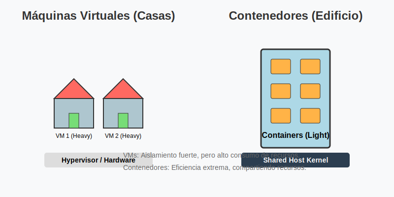
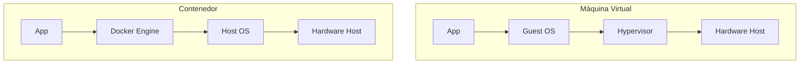

# VMs vs Contenedores

## Introducción

Este subtema aborda la diferencia fundamental entre Máquinas Virtuales (VMs) y Contenedores. Entender esto es crucial para justificar por qué Docker ha revolucionado la industria.

Para empezar, usemos una **analogía clave**:

- **Máquinas Virtuales (VMs)**: Son como **casas independientes**. Cada una tiene sus propios cimientos, tuberías, sistema eléctrico y paredes gruesas. Son muy privadas (aisladas), pero ocupan mucho espacio y construir cada una es costoso y lento.
- **Contenedores**: Son como **apartamentos en un rascacielos**. Todos comparten los mismos cimientos, la misma entrada de agua y luz (el Sistema Operativo del Host), pero cada uno es un espacio privado para vivir. Son rápidos de construir, baratos y ocupan menos espacio.

## Objetivos de Aprendizaje

Al finalizar este subtema, serás capaz de:

1. Explicar la arquitectura de una Máquina Virtual.
2. Explicar la arquitectura de un Contenedor.
3. Comparar ambas tecnologías en términos de rendimiento, peso y aislamiento.

## Contenido Teórico

### 1. La Era de la Virtualización (VMs)

Antes de Docker, la forma estándar de aislar aplicaciones era usar **Máquinas Virtuales**.

**Arquitectura de una VM**:

- **Hardware**: El servidor físico real (CPU, RAM, Disco).
- **Hypervisor** (ej. VMware, VirtualBox): Es el software "gerente". Se sienta sobre el hardware y reparte los recursos. Crea las "casas independientes".
- **Guest OS** (Sistema Operativo Invitado): Cada VM necesita instalar su propio Windows o Linux completo. ¡Esto es muy pesado! (Ocupa Gigabytes).
- **Aplicación**: Tu código final.

**Desventajas**:

- **Peso excesivo**: Repites archivos del sistema operativo una y otra vez.
- **Lentitud**: Arrancar una VM toma minutos (como prender una PC real).
- **Desperdicio**: Muchos recursos se van en mantener vivos los sistemas operativos invitados, no en tu app.

### 2. La Revolución de los Contenedores

**Artefacto Visual: Comparación VM vs Contenedor**

### Comparación de Arquitectura

Los contenedores proponen un modelo diferente: **Virtualización a nivel de Sistema Operativo**.

**Arquitectura de un Contenedor**:

- **Hardware**: Servidor físico.
- **Host OS**: Tienes un solo sistema operativo principal (el "Host") instalado en la máquina.
- **Container Engine (Docker)**: Es el "conserje" del edificio. Permite que múltiples aplicaciones compartan el núcleo (Kernel) del Host OS.
- **Binarios + App**: El contenedor solo empaqueta tu código y lo mínimo necesario para que funcione.

**Ventajas**:

- **Ligereza**: Pesan Megabytes (MB) en lugar de Gigabytes.
- **Velocidad**: Arrancan en milisegundos. Para el sistema, un contenedor es solo un proceso más (como abrir el Bloc de Notas).
- **Eficiencia**: Puedes meter muchas más aplicaciones en el mismo servidor ("Mayor densidad").

### 3. Tabla Comparativa

| Característica   | Máquina Virtual (VM)          | Contenedor                                       |
| :--------------- | :---------------------------- | :----------------------------------------------- |
| **Analogía**     | Casa Independiente            | Apartamento en Edificio                          |
| **Aislamiento**  | Total (Hardware virtualizado) | Parcial (Procesos aislados, kernel compartido)   |
| **Peso**         | Gigabytes (GB) - Muy pesado   | Megabytes (MB) - Muy ligero                      |
| **Arranque**     | Minutos (Lento)               | Milisegundos (Instantáneo)                       |
| **Kernel**       | Cada VM tiene el suyo         | Todos comparten el del Host                      |
| **Portabilidad** | Difícil (archivos gigantes)   | Excelente (La imagen corre igual en todos lados) |

## Resumen

- Las **VMs** virtualizan el **hardware**. Son pesadas pero ofrecen aislamiento robusto (ideales si necesitas seguridad extrema o diferentes sistemas operativos: Windows sobre Linux).
- Los **Contenedores** virtualizan el **sistema operativo**. Son ligeros, rápidos y portátiles.
- Docker democratizó el uso de contenedores. Convirtió una tecnología compleja en algo que cualquier desarrollador puede usar con un simple comando.
