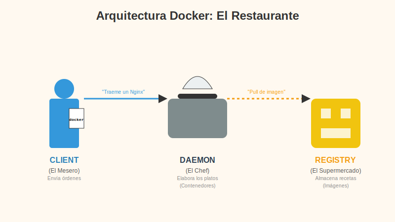
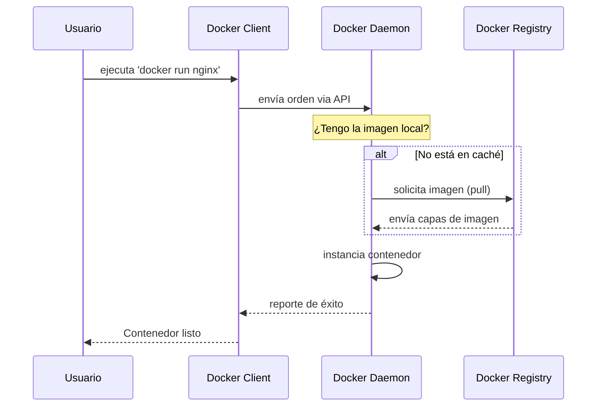

# Contenido del Subtema 2: Arquitectura Docker Engine

## Objetivo

Al finalizar este subtema, serás capaz de:

1.  Describir los componentes principales del Docker Engine.
2.  Explicar cómo interactúan el daemon (el cerebro), el client (tu herramienta) y el registry (la nube).
3.  Entender el flujo de comandos desde el cliente hasta la creación de contenedores.

## Contenido Teórico

Docker funciona con una arquitectura **Cliente-Servidor**. Para entenderlo, usemos la analogía de un **Restaurante**.

### 1. Docker Client (`docker`) - "El Mesero"
*   **¿Qué es?**: Es la herramienta que usas en tu terminal (`docker build`, `docker run`).
*   **Analogía**: Es como el mesero. Tú le dices lo que quieres ("Tráeme un Nginx"), y él anota la orden y se la lleva a la cocina.
*   **Importante**: El cliente *no* crea ni corre contenedores. Solo transmite mensajes.

### 2. Docker Daemon (`dockerd`) - "El Chef"
*   **¿Qué es?**: Es un proceso que corre en segundo plano (generalmente invisible) en tu computadora o servidor.
*   **Analogía**: Es el Jefe de Cocina. Recibe la orden del mesero (Cliente) y hace el trabajo pesado: descarga ingredientes, corta, cocina y sirve el plato (Contenedor).
*   **Función**: Gestiona todos los objetos: Contenedores, Imágenes, Redes y Volúmenes.

### 3. Docker Registry - "El Supermercado"
*   **¿Qué es?**: Un almacén en la nube (o local) donde viven las imágenes de Docker. El más famoso es **Docker Hub**.
*   **Analogía**: Es el supermercado o el gran libro de recetas. Si el Chef (Daemon) no tiene los ingredientes para hacer "Pizza" (Imagen de Nginx) en su cocina local, va al Supermercado (Registry) y los descarga (`pull`).

---

### Flujo de Trabajo: ¿Qué pasa cuando ejecutas un comando?

Veamos la película completa cuando escribes `docker run nginx`:

1.  **Tú (Usuario)**: Escribes `docker run nginx` en la terminal.
2.  **Cliente (Mesero)**: Toma el comando, lo traduce a una petición API y se lo envía al Daemon.
3.  **Daemon (Chef)**:
    *   Revisa su cocina (caché local): "¿Tengo la imagen de `nginx`?"
    *   **Caso A (La tiene)**: Crea el contenedor inmediatamente.
    *   **Caso B (No la tiene)**: Va al **Registry** (Supermercado), descarga la imagen (`docker pull`) y luego crea el contenedor.
4.  **Resultado**: El contenedor cobra vida.

### Tipos de Registry
*   **Público**: Como *Docker Hub*. Cualquiera puede descargar imágenes de allí (Ubuntu, Python, Node, etc.).
*   **Privado**: Empresas usan registros privados (en AWS, Azure, Google Cloud) para guardar el código de sus propias aplicaciones de forma segura.

## Resumen

*   **Docker Engine** no es una sola pieza, es un sistema de partes que colaboran.
*   El **Cliente** habla con el **Daemon**.
*   El **Daemon** hace el trabajo real.
*   El **Registry** guarda las imágenes para que puedas descargarlas donde quieras.
