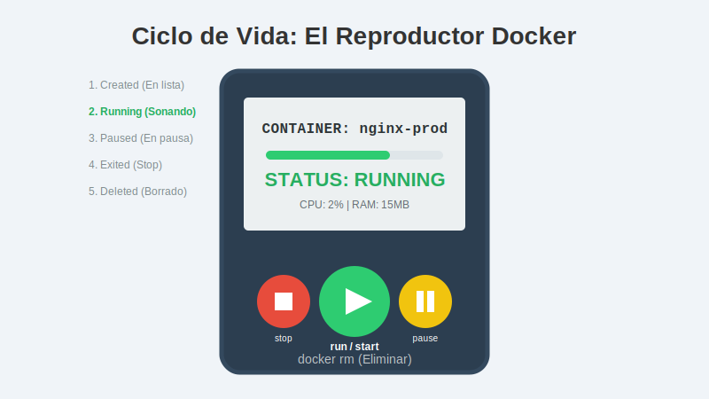
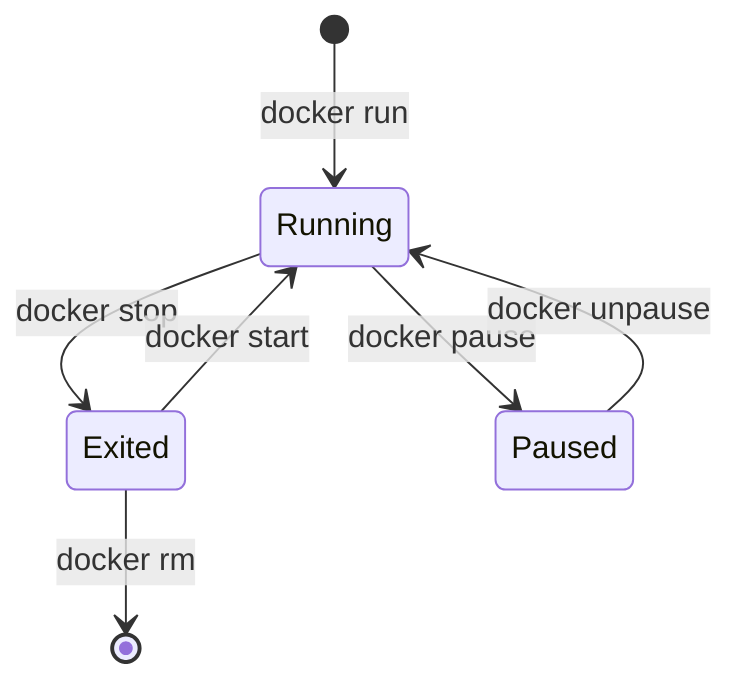

# 2. Ciclo de vida básico

## Objetivo

Al finalizar este subtema, serás capaz de:

1.  Dominar el control remoto de tus contenedores: **crear**, **iniciar**, **detener** y **eliminar**.
2.  Entender la diferencia vital entre correr en "Primer Plano" (Interactive) y "Segundo Plano" (Detached).
3.  Entrar dentro de un contenedor en ejecución para espiarlo (`exec`).

## Contenido Teórico

Imagina que un contenedor es como un **Reproductor de Música** (o un servicio de streaming).



### 1️⃣ Los Estados del Ciclo de Vida

1.  **Created (Creado)**: La canción está en la lista, pero no suena.
2.  **Running (Sonando)**: El proceso está activo. La música suena.
3.  **Paused (Pausado)**: Congelado en el tiempo. La CPU deja de procesarlo, pero sigue en memoria.
4.  **Exited (Detenido)**: La canción terminó o le diste Stop. El contenedor existe, pero no consume CPU ni RAM.
5.  **Deleted (Eliminado)**: Borraste el archivo de la lista. Ya no existe.

### 2️⃣ Los Comandos Esenciales (Tu Control Remoto)

Sigue la lógica del reproductor:

*   **`docker run`**: Es el botón mágico. Hace dos cosas: Descarga/Crea la canción (Create) y le da Play (Start) inmediatamente.
*   **`docker stop <nombre>`**: Botón de Stop. El contenedor se apaga suavemente (guarda sus cosas y se va).
*   **`docker start <nombre>`**: Botón de Play (para uno que ya existe y estaba en Stop).
*   **`docker rm <nombre>`**: Tirar a la basura. Elimina el contenedor para siempre.
    *   *Nota*: No puedes borrar un contenedor que está sonando (Running). Primero dale `stop` y luego `rm`. (O usa `rm -f` para forzarlo, como desenchufar el cable).

### 3️⃣ Modos de Ejecución: ¿Dónde está mi terminal?

Esto confunde a muchos. Hay dos formas de correr un contenedor:

**A. Modo Interactivo (`-it`)**
*   **Comando**: `docker run -it ubuntu`
*   **Efecto**: Tu terminal *se mete dentro* del contenedor. Si cierras la terminal, el contenedor muere.
*   **Uso**: Para pruebas rápidas o explorar.

**B. Modo Detached / Segundo Plano (`-d`)**
*   **Comando**: `docker run -d nginx`
*   **Efecto**: El contenedor arranca y te devuelve el control de la terminal inmediatamente. Sigue corriendo "en el fondo" (background).
*   **Uso**: Servidores web, bases de datos, aplicaciones reales.

### 4️⃣ Espiando dentro del Contenedor (`exec`)

A veces tienes un servidor web corriendo en fondo (`-d`) y quieres entrar a ver un archivo de configuración.

*   **`docker exec -it <nombre> bash`**:
    *   Es como abrir una puerta trasera en un contenedor que ya está funcionando.
    *   Te da una terminal *dentro* de él sin detenerlo.

## Paso a Paso práctico

Vamos a jugar con un servidor web **Nginx**.

1.  **Crear y Correr (Play)**:
    ```bash
    docker run -d --name mi-web -p 8080:80 nginx
    ```
    *   `-d`: Corre en fondo.
    *   `--name`: Lo bautizamos "mi-web".
    *   `-p`: Conectamos el puerto 8080 de tu PC al 80 del contenedor.

2.  **Verificar (Ver la lista)**:
    ```bash
    docker ps
    ```
    Verás que está "Up" (Running).

3.  **Pausar**:
    ```bash
    docker stop mi-web
    ```
    Si haces `docker ps` ya no sale. Haz `docker ps -a` (all) para ver los detenidos.

4.  **Eliminar**:
    ```bash
    docker rm mi-web
    ```


## Diagrama Visual



## Resumen

*   **`run`** = Descargar + Crear + Ejecutar.
*   Usa **`-d`** (Detached) para servicios que deben quedarse corriendo (Web, BD).
*   Usa **`stop`** antes de **`rm`**.
*   **`docker ps`** es tu mejor amigo para saber qué está pasando.
