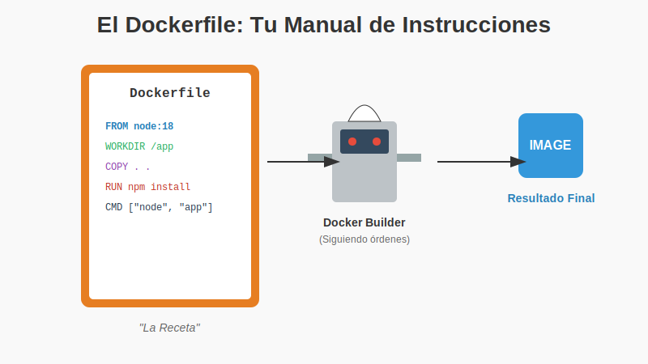
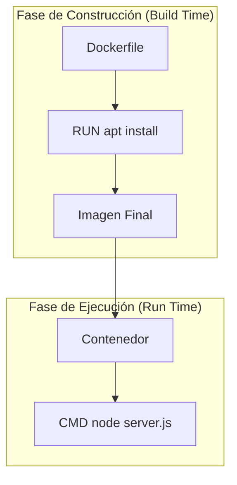

# 1. Instrucciones Clave

## Objetivo

Al finalizar este subtema, serás capaz de:

1.  Leer y escribir un **Dockerfile** sin miedo.
2.  Entender la diferencia crucial entre cosas que pasan durante la construcción (`RUN`) y cosas que pasan al ejecutar (`CMD`).
3.  Conocer por qué preferimos `COPY` sobre `ADD`.

## Contenido Teórico

### El Dockerfile es una Receta de Cocina

Un Dockerfile no es código mágico, es una lista de instrucciones paso a paso para crear una imagen. Imagina que estás escribiendo una receta para que un robot cocine por ti.



#### Las Instrucciones Básicas

1.  **`FROM` (El ingrediente base)**
    *   *Analogía*: "Empieza con una masa de pizza precocinada".
    *   *Uso*: `FROM node:18`. Siempre es la primera línea. Nunca empieces desde cero (scratch) si puedes evitarlo.

2.  **`WORKDIR` (La mesa de trabajo)**
    *   *Analogía*: "Pon todos los ingredientes sobre la mesa `X`".
    *   *Uso*: `WORKDIR /app`. Crea una carpeta dentro del contenedor y se mete en ella. Evita que tires tus archivos en la raíz (`/`) del sistema.

3.  **`COPY` (Traer los ingredientes)**
    *   *Analogía*: "Saca los tomates de tu bolsa de compras y ponlos en la mesa".
    *   *Uso*: `COPY . .` (Copia todo lo de tu carpeta actual a la carpeta `/app` del contenedor).

4.  **`RUN` (Cocinar - Build Time)**
    *   *Analogía*: "Mete la pizza al horno por 20 min".
    *   *Importante*: Esto sucede **una sola vez** cuando creas la imagen. El resultado (la pizza horneada) se guarda para siempre.
    *   *Uso*: `RUN npm install` (Instala librerías).

5.  **`CMD` (Servir - Run Time)**
    *   *Analogía*: "Cuando llegue el cliente, sírvele la pizza".
    *   *Importante*: Esto sucede **cada vez** que alguien inicia el contenedor.
    *   *Uso*: `CMD ["node", "server.js"]` (Arranca mi app).

---

### Conceptos Avanzados Simplificados

#### A. RUN vs CMD (¡Crítico!)



*   **RUN**: Pasa en la **Fábrica**. Modifica el disco de la imagen (instala cosas, compila).
*   **CMD**: Pasa en **Tu Casa**. Ejecuta el proceso principal (enciende el servidor web).
    *   *Regla de oro*: Si quieres instalar algo, usa `RUN`. Si quieres arrancar algo, usa `CMD`.

#### B. COPY vs ADD
Ambos copian cosas, pero `ADD` es el primo extraño.
*   **COPY**: Hace lo que dice. Copia un archivo. **(Usa este el 99% de las veces)**.
*   **ADD**: Copia, pero si le das un `.tar.gz`, lo descomprime solo. Si le das una URL, descarga el archivo. Es "magia" implícita que puede causar errores.

#### C. CMD vs ENTRYPOINT
*   **CMD**: Es una sugerencia. "Por defecto, ejecuta esto". Pero el usuario puede cambiarlo escribiendo `docker run mi-imagen OTRO_COMANDO`.
*   **ENTRYPOINT**: Es una orden. "Vas a ejecutar esto sí o sí". Lo que escriba el usuario se agrega como argumentos al final.

## Paso a Paso práctico

Vamos a crear una imagen de Node.js "de juguete".

1.  Crea un archivo llamado `Dockerfile` (sin extensión) con esto:
    ```dockerfile
    # 1. Base
    FROM node:alpine

    # 2. Mesa de trabajo
    WORKDIR /app

    # 3. Ingredientes (Solo el package.json primero para aprovechar caché)
    COPY package.json .

    # 4. Cocinar (Instalar dependencias)
    RUN npm install

    # 5. Resto de ingredientes
    COPY . .

    # 6. Servir
    CMD ["node", "index.js"]
    ```

2.  Construye la imagen (El Chef cocina):
    ```bash
    docker build -t mi-app-node .
    ```

3.  Pruébala (Servir el plato):
    ```bash
    docker run mi-app-node
    ```

## Resumen

*   Piensa en el Dockerfile como una receta lineal.
*   **RUN** es para preparar (build), **CMD** es para ejecutar (run).
*   Usa **WORKDIR** para ser ordenado.
*   Usa **COPY** y evita `ADD`.
