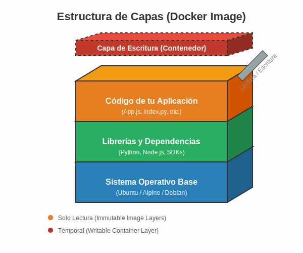
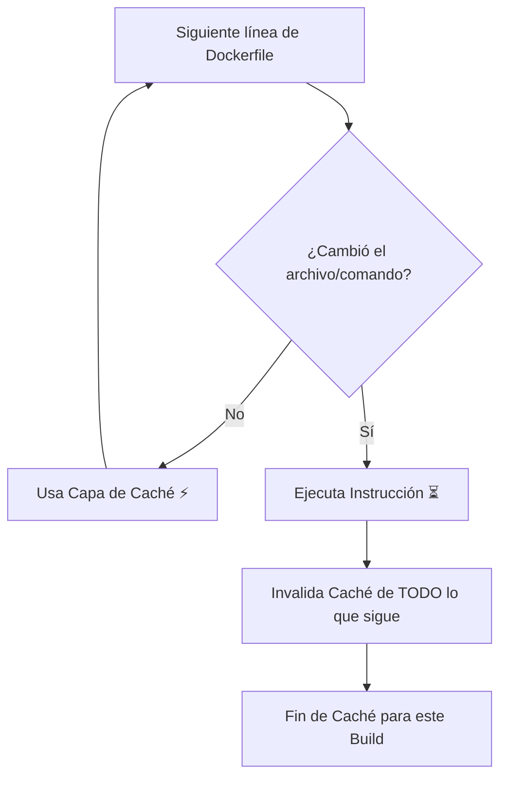

# 2. Gestión de Caché

## Objetivo

Al finalizar este subtema, serás capaz de:

1.  Hacer que tus builds pasen de tardar 5 minutos a 5 segundos.
2.  Entender el principio de **Capas de Cebolla** (o de Pastel) de Docker.
3.  Ordenar tu Dockerfile estratégicamente para aprovechar la memoria de Docker.

## Contenido Teórico

### El Secreto: Docker es perezoso (y eso es bueno)

Docker es extremadamente flojo. Cada vez que le pides construir una imagen, él revisa línea por línea del Dockerfile y se pregunta: **"¿Ya hice esto antes?"**.

*   Si la respuesta es **SÍ**: No hace nada. Usa la copia guardada (Caché).
*   Si la respuesta es **NO**: Ejecuta la instrucción y... **aquí viene el truco**: invalida (borra) la caché de **todas las líneas que vienen después**.


### La Analogía del Pastel de Pisos

**Artefacto Visual: El Pastel de Capas en Docker**


Imagina que estás construyendo un pastel:
1.  Piso 1. El Bizcocho (OS Base).
2.  Piso 2: El Relleno (Dependencias/Librerías).
3.  Piso 3: La Decoración (Tu Código Fuente).

Si decides cambiar el **Piso 1** (el bizcocho), obligatoriamente tienes que tirar el relleno y la decoración y volver a ponerlos.
Pero si solo cambias la **Decoración** (Piso 3), el bizcocho y el relleno no se tocan. ¡Ahorras tiempo!

### El Error del Novato (Rompiendo la Caché)

Mira este Dockerfile. Es el error más común del mundo:

```dockerfile
# ❌ ORDEN INCORRECTO
FROM node:18
WORKDIR /app

# 1. Copiamos TODO el código (incluyendo package.json)
COPY . .

# 2. Instalamos dependencias
RUN npm install
```

**¿Qué pasa aquí?**
1.  Modificas una sola línea de tu código (la decoración).
2.  Docker llega a `COPY . .` y ve que el archivo cambió. **¡Caché invalidada!**
3.  Como la capa anterior cambió, Docker dice "Tengo que ejecutar todo lo que sigue de nuevo".
4.  Resultado: Vuelve a ejecutar `RUN npm install` y descarga 500MB de internet. **Lento**.


### Diagrama: Lógica de la Caché



### La Forma Correcta (Cacheo Inteligente)

```dockerfile
# ✅ ORDEN CORRECTO
FROM node:18
WORKDIR /app

# 1. Copiamos SOLO la definición de dependencias (Lo que menos cambia)
COPY package.json .
COPY package-lock.json .

# 2. Instalamos. (Docker guardará esto en caché)
RUN npm install

# 3. AHORA copiamos el código fuente (Lo que más cambia)
COPY . .
```

**¿Por qué es mejor?**
Cuando cambies tu código (`app.js`), Docker verá que `package.json` **no ha cambiado**. Reutilizará la capa de `npm install` (¡Instantáneo!) y solo ejecutará el `COPY . .` final.

---

### Avanzado: Cache Mounts

A veces, incluso si cambias el `package.json` (agregas una librería), no quieres descargar TODAS las librerías de nuevo, solo la nueva.
Docker BuildKit permite "montar" una caché real de disco:

```dockerfile
# Guarda lo que baja npm en una carpeta especial que sobrevive entre builds
RUN --mount=type=cache,target=/root/.npm \
    npm ci
```

## Resumen

*   **Regla de Oro**: Ordena tu Dockerfile de lo **más estable** (arriba) a lo **más volátil** (abajo).
*   **Estable**: OS, Instalación de herramientas, `package.json`.
*   **Volátil**: Tu código fuente (`.js`, `.py`, `.go`).
*   Si optimizas la caché, tus compañeros de equipo te amarán (y tu CI/CD volará).
