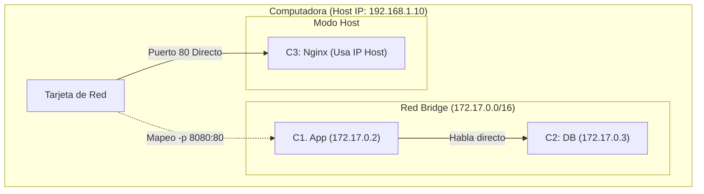

# 1. Drivers de Red

## Objetivo

Al finalizar este subtema, serás capaz de:

1.  Entender cómo Docker aísla las redes (y cuándo romper ese aislamiento).
2.  Elegir el driver correcto (`bridge`, `host`, `none`) para tu caso de uso.
3.  Evitar el error clásico de intentar conectarte a `localhost` entre contenedores.

## Contenido Teórico


### La Analogía de la Casa




Imagina que tu servidor (Host) es una **Casa**. Tiene una dirección en la calle (IP Pública) y varias puertas (Puertos).

#### 1. Driver `bridge` (El Cuarto Privado) - *Opción por Defecto*
Cuando creas un contenedor y no dices nada, Docker construye un **Cuarto Privado** dentro de la casa.
*   **Aislamiento**: Los contenedores dentro de este cuarto pueden hablar entre sí, pero están invisibles para el mundo exterior.
*   **Acceso**: Para que alguien de afuera entre, tienes que abrir una ventana específica. Eso es el comando `-p 8080:80` (Mapeo de puertos).
*   **Uso**: El 95% de las veces usarás esto.

#### 2. Driver `host` (La Sala Principal)
Aquí no construimos ningún cuarto. El contenedor se sienta en el sofá de la sala.
*   **Aislamiento**: Nulo. El contenedor usa la MISMA dirección IP que tu computadora.
*   **Acceso**: Si el contenedor escucha en el puerto 80, ocupará el puerto 80 de tu computadora real.
*   **Ventaja**: Máximo rendimiento (no hay traducción de direcciones).
*   **Desventaja**: Solo puedes tener UN contenedor escuchando en el puerto 80. (Conflicto de puertos).
*   **Uso**: Apps que necesitan rendimiento extremo o protocolos de red complejos.

#### 3. Driver `none` (El Sótano)
*   **Aislamiento**: Total. Sin cable de red. Sin Wi-Fi.
*   **Uso**: Trabajos batch de seguridad extrema que procesan datos sensibles y mueren, sin necesidad de hablar con nadie.

---

### El Error del Principiante: "Localhost"

Este es el concepto más importante de este módulo.

**Escenario**: Tienes un contenedor con MySQL (Puerto 3306) y otro con tu App Node.js.
**Error**: En tu código Node.js pones: `db_host = 'localhost'`.
**Resultado**: `Connection Refused`.

**¿Por qué?**
Para un contenedor, `localhost` significa **"Yo Mismo"**.
Cuando tu App dice "conecta a localhost:3306", se está buscando a sí misma. ¡Y la base de datos no está ahí, está en el contenedor de al lado!

**Solución**:
Usar **Redes Personalizadas (Custom Networks)** para que los contenedores se llamen por su nombre (DNS). Lo veremos en el siguiente subtema.

## Paso a Paso práctico

1.  **Modo Bridge (Lo normal)**:
    ```bash
    # Creamos un Nginx. Está aislado.
    docker run -d --name web-aislada nginx
    # Intentamos acceder. Fallará.
    curl localhost:80
    ```

2.  **Abriendo la ventana (Publish)**:
    ```bash
    # Mapeamos el puerto 8080 de la casa al 80 del cuarto.
    docker run -d --name web-publica -p 8080:80 nginx
    # Ahora sí.
    curl localhost:8080
    ```

3.  **Modo Host (Sin aislamiento)**:
    *Solo funciona en Linux nativo (en Mac/Windows Docker Desktop tiene limitaciones con mode host).*
    ```bash
    docker run -d --name web-host --network host nginx
    # El contenedor toma el puerto 80 de tu máquina directamente.
    curl localhost:80
    ```

## Resumen

*   **Bridge**: Es lo estándar. Aísla y publias solo lo que quieres.
*   **Host**: Sin filtros. Rápido pero peligroso (conflictos de puertos).
*   **Localhost**: Nunca lo uses para hablar entre contenedores. Significa "mi propio ombligo".
