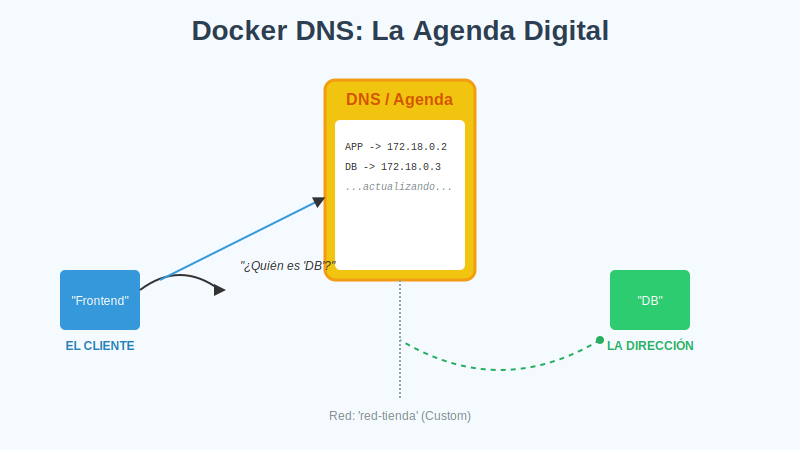

# 2. DNS y Descubrimiento de Servicios

## Objetivo

Al finalizar este subtema, serás capaz de:

1.  Olvidarte para siempre de las direcciones IP.
2.  Conectar contenedores usando sus nombres (ej. `mysql`).
3.  Entender la trampa de la red por defecto (y por qué siempre debes crear la tuya).

## Contenido Teórico

### El Problema: Las IPs cambian

Los contenedores son efímeros. Si reinicias una base de datos, es muy probable que reviva con una dirección IP diferente (hoy es `172.18.0.2`, mañana `172.18.0.5`).
Si configuras tu aplicación para conectarse a una IP fija, se romperá constantemente.

Docker tiene un servidor DNS interno (una agenda de contactos) integrada. Funciona así:



1.  Creas un contenedor y le pones nombre: `docker run --name mi-base-datos ...`
2.  Docker anota en su agenda: "El nombre `mi-base-datos` corresponde a la IP `172.X.X.X`".
3.  Cualquier otro contenedor en la misma red puede decir: "Quiero conectar con `mi-base-datos`".
4.  Docker le responde con la IP correcta en ese momento.

¡Es mágico! Si el contenedor de base de datos se borra y creas uno nuevo con el mismo nombre, Docker actualiza la agenda y todo sigue funcionando.

---

### ⚠️ La Trampa Mortal: La Red por Defecto

Docker viene con una red llamada `bridge` pre-creada. Si no especificas ninguna red, tus contenedores caen ahí.
**EL DNS MÁGICO NO FUNCIONA EN LA RED POR DEFECTO.**

En la red `bridge` por defecto, los contenedores **no pueden** resolverse por nombre. Tienen que usar IPs (lo cual es malo).
Para tener DNS, **siempre** debes crear tu propia red.

---

### Service Discovery en Swarm (Nivel Avanzado)

```mermaid
sequenceDiagram
    participant C1 as Container A
    participant DNS as Docker DNS
    participant C2 as Container B (IP variable)
    
    Note over C1, C2: En red personalizada
    C1->>DNS: ¿Dónde está "ContainerB"?
    DNS->>DNS: Consulta Agenda
    DNS-->>C1. Está en 172.18.0.3
    C1->>C2: Conexión a 172.18.0.3 (vía nombre)
```

Cuando usas Docker Swarm (clúster de varios servidores), esto se vuelve aún más poderoso.
Si tienes 3 réplicas de una web (`web-1`, `web-2`, `web-3`), Docker crea un solo nombre `web`. Cuando alguien llama a `web`, Docker hace de operador telefónico y pasa la llamada a cualquiera de las 3 réplicas disponible (Balanceo de Carga).

## Paso a Paso práctico

Vamos a probar la magia del DNS.

1.  **Crear una red propia** (Obligatorio para que funcione el DNS):
    ```bash
    docker network create red-fiesta
    ```

2.  **Crear el "Servidor"**:
    ```bash
    # Lanzamos un contenedor de ping y lo llamamos 'amigo'
    docker run -d --name amigo --network red-fiesta alpine sleep 3600
    ```

3.  **Probar la conexión**:
    ```bash
    # Lanzamos otro contenedor y tratamos de hacer ping a 'amigo'
    docker run --rm --network red-fiesta alpine ping -c 2 amigo
    ```
    *Resultado*: Verás `PING amigo (172.x.x.x)`. ¡Resolvió el nombre!

4.  **Prueba fallida (La trampa)**:
    Intenta lo mismo sin la red personalizada (usando la default):
    ```bash
    docker run -d --name amigo-triste alpine sleep 3600
    docker run --rm alpine ping -c 2 amigo-triste
    ```
    *Resultado*: `bad address 'amigo-triste'`. (Sin red propia, no hay agenda telefónica).

## Resumen

*   **Nunca uses IPs fijas**.
*   Los contenedores se encuentran por su **nombre** (`--name`).
*   Para que esto funcione, **debes crear una red** (`docker network create`).
*   Docker se encarga de actualizar la IP si el contenedor cambia.
