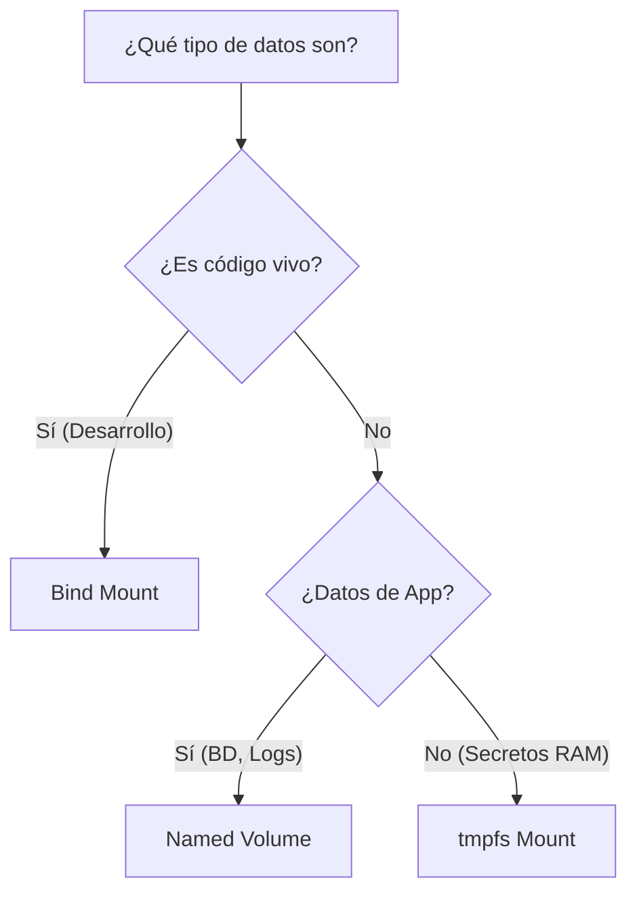

# 1. Tipos de Monturas

## Objetivo

Al finalizar este subtema, serás capaz de:

1.  Hacer que tus datos sobrevivan a la muerte de un contenedor.
2.  Elegir entre la "Caja Fuerte" (Volume) y la "Ventana Mágica" (Bind Mount).
3.  Editar código en tu PC y verlo reflejado al instante en el contenedor.

## Contenido Teórico

### El Problema: Amnesia

Por defecto, los contenedores sufren de amnesia total.
Si escribes un archivo dentro de un contenedor y luego lo borras (`rm`), ese archivo desaparece para siempre. El disco duro del contenedor es efímero.

Para arreglar esto, usamos **Monturas (Mounts)**.

---


### Opción A: Volumes (La Caja Fuerte) - *Para Producción*

**Artefacto Visual: Volumen vs Bind Mount**


Le dices a Docker: *"Necesito guardar estos archivos, no me importa dónde, pero que no se pierdan"*.
Docker crea una carpeta en una zona protegida de tu disco duro (gestionada por él) y la conecta al contenedor.

*   **Ventaja**: Es lo más seguro y fácil. Funciona igual en Linux, Mac y Windows.
*   **Uso**: Bases de datos (MySQL, Postgres), logs.
*   **Comando**:
    ```bash
    # Crame un volumen llamado 'mis-datos' y pónlo en /data
    docker run -v mis-datos:/data alpine ...
    ```

### Opción B: Bind Mounts (La Ventana Mágica) - *Para Desarrollo*

Le dices a Docker: *"Quiero que la carpeta `C:\Proyectos\MiApp` de mi computadora sea EXACTAMENTE la misma que la carpeta `/app` del contenedor"*.

Es como abrir un portal.
*   Si cambias un archivo en tu PC, cambia en el contenedor.
*   Si el contenedor crea un archivo, aparece en tu escritorio.

*   **Ventaja**: ¡Editas código en VS Code y el servidor en Docker se actualiza solo! (Hot Reload).
*   **Desventaja**: Depende de tus carpetas locales. Si le pasas este comando a un amigo con otra estructura de carpetas, fallará.
*   **Comando**:
    ```bash
    # Conecta mi carpeta actual $(pwd) a /app
    docker run -v $(pwd):/app node ...
    ```

### Opción C: tmpfs (Memoria RAM)

Los datos se guardan en la RAM de tu computadora.
*   **Uso**: Datos ultra-secretos (claves) o ultra-rápidos que NO quieres que toquen el disco duro nunca. Si apagas la PC, se esfuman.

---

### ¿Cuál elegir? (Diagrama de Decisión)



## Tabla de Decisión Rápida

| ¿Qué quieres hacer? | Usa esto |
| :--- | :--- |
| Guardar datos de una Base de Datos | **Volume** |
| Editar código fuente desde tu PC | **Bind Mount** |
| Compartir datos entre contenedores | **Volume** |
| Guardar claves SSH temporales | **tmpfs** |

## Paso a Paso práctico

1.  **Prueba de Amnesia (Sin Volumen)**:
    ```bash
    docker run --name sin-memoria alpine touch /hola.txt
    docker rm -f sin-memoria
    docker run --name sin-memoria alpine ls /hola.txt
    # Error: No such file or directory
    ```

2.  **Prueba de Elefante (Con Volumen)**:
    ```bash
    # Usamos -v nombre-volumen:/ruta
    docker run --name con-memoria -v mi-volumen:/datos alpine touch /datos/hola.txt
    docker rm -f con-memoria
    # Creamos uno NUEVO, pero conectado a la misma "Caja Fuerte"
    docker run --name nuevo -v mi-volumen:/datos alpine ls /datos/hola.txt
    # Éxito: hola.txt
    ```

## Resumen

*   Los contenedores son efímeros. Los datos importantes deben salir de ellos.
*   Usa **Volumes** para datos que el contenedor genera (DBs).
*   Usa **Bind Mounts** para meter tu código dentro.
