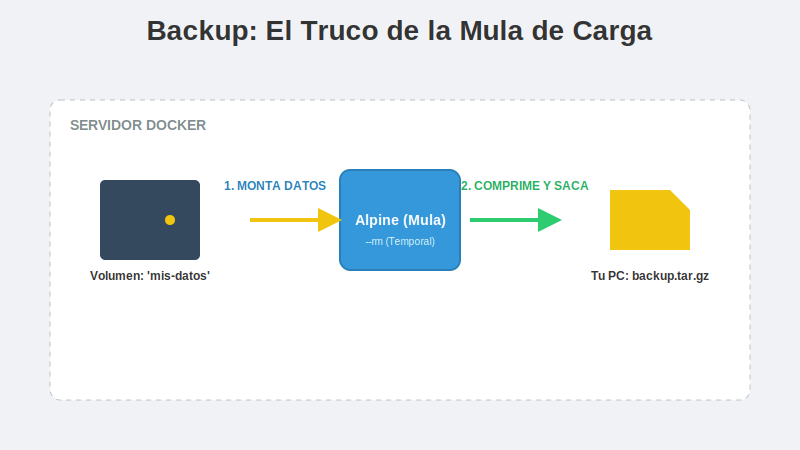

# 2. Backups y Migración

## Objetivo

Al finalizar este subtema, serás capaz de:

1.  Salvar tus datos antes de que sea demasiado tarde.
2.  Entender el "Truco del Contenedor Efímero" (la forma estándar de hacer backups en Docker).
3.  Mover tus datos de un servidor a otro (Migración).

## Contenido Teórico

### El Desafío: Los Volúmenes son "Cajas Fuertes Cerradas"

Los volúmenes están protegidos en rutas del sistema (`/var/lib/docker/...`) que a veces ni siquiera el usuario root puede ver fácilmente (especialmente en Mac/Windows).
Entonces, ¿cómo sacamos los datos para guardarlos en un USB o subirlos a la nube?

Respuesta: **Usamos otro contenedor como "Mula de Carga"**.



---

### La Técnica del Contenedor Efímero

Esta es la receta que usarás toda tu vida profesional. No te asustes por la longitud del comando, vamos a diseccionarlo.

**La lógica**:
1.  Creamos un contenedor pequeño y temporal (`alpine`).
2.  Le conectamos DOS cosas:
    *   El Volumen que queremos salvar (Origen).
    *   Una carpeta de nuestra PC actual (Destino).
3.  Ejecutamos `tar` (comprimir) de uno a otro.
4.  El contenedor muere y nos deja el archivo regalado.

**El Comando Mágico**:
```bash
# Supongamos que queremos salvar el volumen 'mis-datos'
docker run --rm \
  -v mis-datos:/origen \
  -v $(pwd):/destino \
  alpine \
  tar czf /destino/backup.tar.gz -C /origen .
```

*   `--rm`: "Cuando termines, autodestruyete".
*   `-v mis-datos:/origen`: "Monta la caja fuerte en la carpeta `/origen`".
*   `-v $(pwd):/destino`: "Monta mi carpeta actual en la carpeta `/destino`".
*   `tar ...`: "Comprime todo lo de `/origen` y guárdalo en `/destino`".

### Migración: Llevando los datos a otro servidor

Una vez que tienes el archivo `backup.tar.gz`, moverlo es trivial.

1.  **En Servidor A**: Haces el backup (como vimos arriba). Tienes `backup.tar.gz`.
2.  **Transferencia**: Usas `scp`, FTP, o un pendrive para llevar el archivo al Servidor B.
3.  **En Servidor B**: Haces el proceso inverso (Restauración).


**Comando de Restauración**:
```bash
# 1. Crear el volumen nuevo
docker volume create mis-datos-nuevos

# 2. Inyectar los datos (Descomprimir)
docker run --rm \
  -v mis-datos-nuevos:/destino \
  -v $(pwd):/origen \
  alpine \
  tar xzf /origen/backup.tar.gz -C /destino
```

### Regla de Oro: ¡Apaga las luces!

Si intentas hacer un backup de una Base de Datos (MySQL, Mongo) mientras está funcionando, es muy probable que el backup salga corrupto (archivos a medio escribir).

**Procedimiento Correcto**:
1.  `docker stop mi-base-datos` (Pausar el negocio).
2.  Ejecutar el comando de Backup (Hacer el inventario).
3.  `docker start mi-base-datos` (Reabrir el negocio).

## Resumen

*   Es imposible "bajar" un volumen con un click. Tienes que usar el **Truco del Contenedor Efímero**.
*   El comando usa dos volúmenes: uno de entrada (tus datos) y uno de salida (tu carpeta actual).
*   **Siempre detén el contenedor** antes de hacer backup para asegurar la integridad de los datos.
