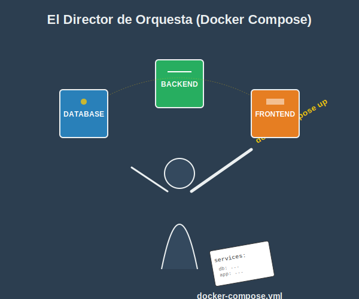
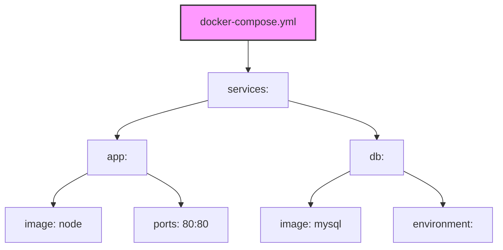

# 1. Docker Compose YAML

## Objetivo

Al finalizar este subtema, serás capaz de:

1.  Dejar de escribir comandos `docker run` kilométricos.
2.  Definir "infraestructura como código" usando un archivo de texto simple.
3.  Levantar aplicaciones complejas (Frontend + Backend + Base de Datos) con **una sola palabra**: `up`.

## Contenido Teórico

### El Problema: El "Script infernal"

Imagina que para arrancar tu aplicación necesitas:
1.  Arrancar una base de datos.
2.  Crear una red privada.
3.  Arrancar el backend y conectarlo a la red y a la base de datos.
4.  Arrancar el frontend y exponer el puerto 80.

Si haces esto con `docker run`, tendrás que escribir 4 comandos gigantes y propensos a errores cada mañana. O peor, hacer un script `.sh` inmanbible.


### La Solución: El Director de Orquesta (Docker Compose)

**Artefacto Visual: El Director de Orquesta**


**Docker Compose** es una herramienta que lee una *partitura* (un archivo YAML) y dirige a todos los músicos (contenedores) para que toquen juntos.

*   No más comandos imperativos ("haz esto, luego esto").
*   Ahora es **Declarativo**: "Quiero que exista un sistema con estas características. Docker, haz que suceda".

Es un archivo de texto donde traduces tus comandos `docker run`.



**Estructura Clave**:
```yaml
services:
  # Nombre del servicio (será su nombre DNS también)
  mi-web:
    image: nginx
    ports:
      - "8080:80"

  mi-base-datos:
    image: postgres
    environment:
      POSTGRES_PASSWORD: secreto
```

**Traducción Rápida**:
*   `docker run` -> Se convierte en una entrada bajo `services:`.
*   `-p 8080:80` -> Se convierte en `ports:`.
*   `-e CLAVE=VALOR` -> Se convierte en `environment:`.
*   `-v vol:/data` -> Se convierte en `volumes:`.

---

### La Regla de Oro del YAML

YAML es un lenguaje *muy* estricto con los espacios.
*   **NO uses tabuladores (Tab)**. Usa siempre espacios (barra espaciadora).
*   La jerarquía se define por la sangría (indentación). Generalmente **2 espacios**.
*   Si un hijo no está alineado bajo su padre, Docker te dará error.

### Comandos de Vida o Muerte

*   **`docker compose up -d`**:
    *   *Significado*: "Lee la partitura, descarga lo que falte, crea las redes, los volúmenes y arranca todo en segundo plano".
*   **`docker compose down`**:
    *   *Significado*: "Apaga todo, borra los contenedores y borra las redes que creaste". (Limpia la casa).
*   **`docker compose logs -f`**:
    *   *Significado*: "Muéstrame qué están diciendo todos los contenedores al mismo tiempo". (Súper útil para ver si la DB falló antes que la App).

## Paso a Paso práctico

1.  Crea un archivo `docker-compose.yml` (¡ojo con el nombre, debe ser exacto!).
2.  Escribe esto:
    ```yaml
    services:
      web:
        image: nginx
        ports:
          - "8000:80"
    ```
3.  Ejecuta `docker compose up -d`.
4.  Entra a `localhost:8000`. ¡Funciona!
5.  Ejecuta `docker compose down`. Desaparece.

## Resumen

*   **Docker Compose** es tu mejor amigo para desarrollo local.
*   El archivo `.yml` describe tu arquitectura completa.
*   **`up`** construye el mundo. **`down`** lo destruye.
*   Cuida la indentación del YAML o sufrirás.
