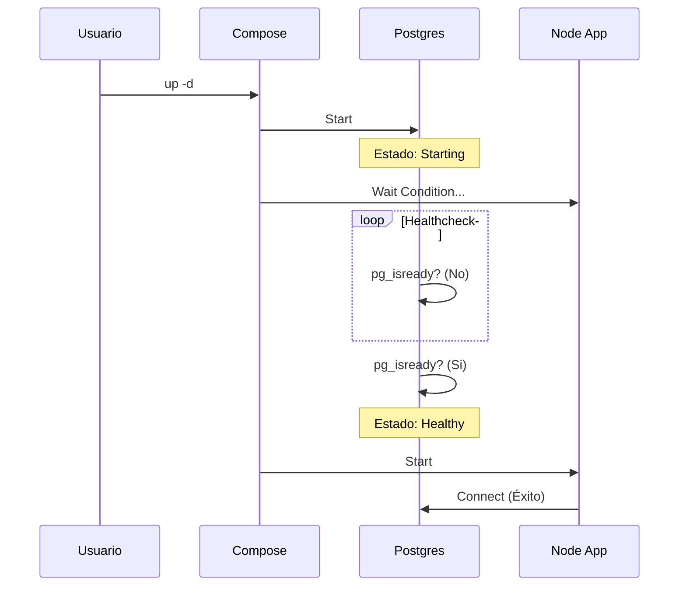

# Contenido del Subtema 2 – Dependencias y Healthchecks

## Objetivo

Al finalizar este subtema, serás capaz de:

1.  Evitar que tu aplicación se rompa al iniciar porque la base de datos "todavía no está lista".
2.  Entender la diferencia entre **Arrancar** y **Estar Listo**.
3.  Usar comandos de **Healthcheck** para que Docker sea inteligente.

## Contenido Teórico

### El Problema: "Llegué demasiado temprano"

Docker Compose es muy rápido. Cuando le das `up`, arranca todo a la vez.

Imagina que tienes una Web y una Base de Datos.
1.  La Web arranca en 1 segundo.
2.  La Base de Datos (Postgres) arranca el contenedor en 1 segundo, **PERO** luego necesita 10 segundos para cargar archivos, verificar índices y abrir el puerto.

**Resultado**: La Web intenta conectar. La Base de Datos (aunque el contenedor está verde) rechaza la conexión. La Web se crashea.

### Depends On (La Solución a Medias)

```yaml
web:
  depends_on:
    - db
```
Esto le dice a Docker: "Arranca el contenedor `db` primero. Un milisegundo después, arranca `web`".
**Problema**: Solo controla el orden de "darle al botón de encendido". No espera a que la base de datos esté lista para trabajar. Es como despertar a alguien y pedirle que resuelva una integral antes de que abra los ojos.

---

### La Solución Real: Healthchecks (El Chequeo Médico)

Un **Healthcheck** es una pregunta que Docker le hace al contenedor cada cierto tiempo: *"¿Estás listo?"*.

*   **Estado: Starting**: Me estoy despertando.
*   **Estado: Healthy**: ¡Listo! Ya me tomé el café.
*   **Estado: Unhealthy**: Algo anda mal (llevo mucho rato intentando arrancar y no puedo).

#### Cómo se implementa (Ejemplo Postgres)

```yaml
services:
  db:
    image: postgres
    # Aquí definimos el médico
    healthcheck:
      test: ["CMD-SHELL", "pg_isready -U postgres"]
      interval: 5s   # Preguntar cada 5 seg
      retries: 5     # Si falla 5 veces, decláralo muerto
    environment:
      POSTGRES_PASSWORD: pass

  web:
    image: mi-app
    depends_on:
      db:
        # ¡La Magia! Espera hasta que el médico diga "Healthy"
        condition: service_healthy
```

Con `condition: service_healthy`, Docker pone en pausa el inicio de `web` hasta que `db` responda "OK" a su test interno.

### Cheat Sheet: Comandos Comunes de Salud

Cada imagen tiene su truco. Aquí los más usados:

*   **Web (Nginx/Node)**: `curl -f http://localhost || exit 1`
*   **Postgres**: `pg_isready -U postgres`
*   **MySQL**: `mysqladmin ping -h localhost`
*   **Redis**: `redis-cli ping`

## Paso a Paso práctico

Vamos a simular un servicio "lento".

1.  Crea un `docker-compose.yml` con dos servicios.
2.  Usa `depends_on` normal y mira cómo fallan si la DB es lenta (o simúlalo con un `sleep`).
3.  Agrega el `healthcheck` y la `condition`.
4.  Observa en la terminal: Verás que el servicio `web` dice "Waiting..." hasta que la DB se pone verde.


## Diagrama de Secuencia



## Resumen

*   Arrancar ≠ Estar Listo.
*   `depends_on` solo controla el orden de arranque.
*   `healthcheck` verifica que la aplicación funcione realmente.
*   Juntos (`condition: service_healthy`) crean una orquestación robusta a prueba de fallos.
