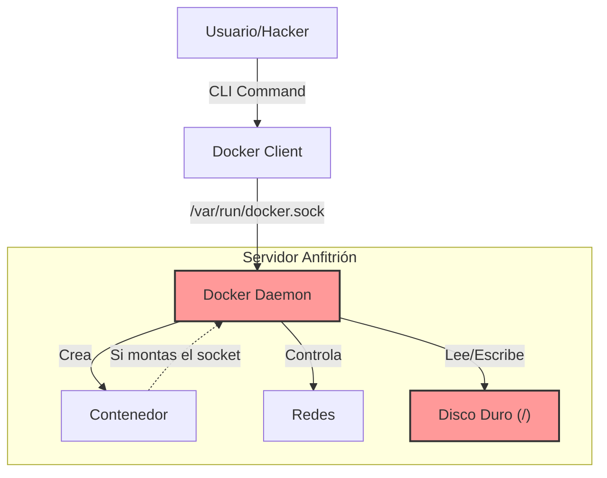

# Contenido del Subtema 1 – Seguridad del Docker Daemon

## Objetivo

Al finalizar este subtema, serás capaz de:

1.  Entender por qué darle acceso a Docker equivale a dar acceso de Administrador (Root).
2.  Proteger la "Llave Maestra" (el Socket de Docker).
3.  Evitar que un hacker tome control de todo tu servidor a través de un contenedor vulnerable.

## Contenido Teórico


### El Mito de la Caja Fuerte

**Diagrama de Seguridad: Superficie de Ataque**


Mucha gente cree que los contenedores son "Cajas Fuertes" totalmente aisladas.
**ERROR**.
Por defecto, los contenedores comparten el mismo Kernel (Cerebro) que el sistema anfitrión. Si el root (Jefe) dentro del contenedor logra engañar al kernel, se convierte en el root de toda la máquina.

### El Talón de Aquiles: `/var/run/docker.sock`

El **Socket de Docker** es un archivo especial que sirve para hablar con el Daemon (el Jefe Supremo).
Es el equivalente informático a la **Varita de Saúco** de Harry Potter o el **Guantelete del Infinito**. Quien lo tenga, lo controla todo.

#### El ataque clásico
Imagina que ejecutas este comando inocente:
```bash
docker run -v /var/run/docker.sock:/var/run/docker.sock mi-imagen-sospechosa
```
Le acabas de pasar la Varita Mágica al contenedor.
Ahora, el código malicioso dentro del contenedor puede decir:
*"Hola Daemon, soy yo. Por favor, monta todo el disco duro del servidor en mi carpeta `/tmp` y bórralo."*
Y el Daemon lo hará.

**Lección**: NUNCA montes el socket en un contenedor a menos que sepas exactamente qué hace esa imagen (ej. Portainer o Traefik) y confíes en ella al 100%.

### Exposición Remota (El error de principiante)

A veces quieres controlar Docker desde otra PC.
Algunos tutoriales te dicen: "Abre el puerto 2375".
**¡NO LO HAGAS!**
El puerto 2375 es Docker **sin contraseña**. Si lo abres en un servidor en la nube, bots rusos y chinos estarán minando criptomonedas en tu servidor en menos de 15 minutos. (Esto es real).

Si necesitas acceso remoto, usa **TLS (Certificados)** o conéctate vía **SSH**.

## Endureciendo el Daemon (`daemon.json`)

Podemos ponerle reglas al Jefe para que sea menos permisivo. Esto se hace en el archivo `/etc/docker/daemon.json`.

```json
{
  "userns-remap": "default",
  "no-new-privileges": true
}
```

*   **`userns-remap`**: La técnica del "Rey Falso". El usuario parece `root` dentro del contenedor, pero en realidad es un usuario "nadie" en el servidor real. Si escapa, no tiene poderes.
*   **`no-new-privileges`**: Prohíbe que un proceso gane más poderes (sudo) de los que tenía al nacer.

## Resumen

*   **El Grupo Docker**: Agregar a tu usuario al grupo `docker` (`usermod -aG docker`) es tan peligroso como darle `sudo` sin contraseña.
*   **El Socket**: Es sagrado. No lo compartas a la ligera.
*   **Acceso Remoto**: Nunca uses el puerto 2375 público. Usa SSH.
