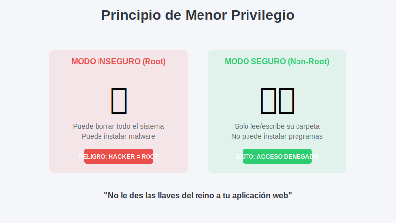

# 2. Usuario No-Root

## Objetivo

Al finalizar este subtema, serás capaz de:

1.  Proteger tu aplicación contra el 90% de los ataques de seguridad.
2.  Crear usuarios "plebeyos" dentro de tus imágenes.
3.  Evitar el error clásico de los puertos bajos (Permission Denied en puerto 80).

## Contenido Teórico

### El Problema: Todos quieren ser el Rey

Por defecto, cuando escribes un Dockerfile, eres el **Rey (Root)**.
*   Puedes instalar programas (`apt install`).
*   Puedes borrar archivos del sistema.
*   Puedes abrir cualquier puerto.

**El Riesgo**: Si un hacker encuentra un hueco en tu aplicación (ej. una inyección de código en tu Node.js), él hereda tus permisos.
Si tu app corría como Rey, **¡el hacker ahora es Rey!** Puede instalar mineros de bitcoin, robar datos o atacar otros servidores.

Si el hacker toma el control del Panadero y trata de quemar el castillo (borrar `/etc`), el sistema le dirá: **"Acceso Denegado"**.



### Cómo implementarlo (La receta correcta)

```dockerfile
FROM node:20-alpine

# 1. Crear al Plebeyo (Grupo y Usuario)
RUN addgroup -S mi-grupo && adduser -S mi-usuario -G mi-grupo

# 2. Definir su lugar de trabajo
WORKDIR /app

# 3. Darle sus herramientas (Archivos)
# ¡OJO! Usa --chown aquí. Si copias como root y luego haces chown, duplicas el peso de la capa.
COPY --chown=mi-usuario:mi-grupo . .

# 4. Abdicar del trono (Cambiar de usuario)
# A partir de esta línea, ya no somos root.
USER mi-usuario

# 5. Ejecutar como plebeyo
CMD ["node", "app.js"]
```

### La Trampa de los Puertos Bajos

En Linux (y por tanto en Docker), los puertos del 1 al 1023 son "Puertos Reales". Solo el **Rey (Root)** puede abrirlos.
Si intentas arrancar un Nginx en el puerto 80 con un usuario limitado, fallará.

**Solución**: Usa puertos altos para usuarios limitados.
*   En vez de puerto 80 -> Puerto 8080.
*   En vez de puerto 443 -> Puerto 8443.

```mermaid
graph TD
    H[Hacker] -->|Ataca App| C[Contenedor]
    subgraph Container[Dentro del Contenedor]
      C --> U{¿Quién es el usuario?}
      U -- Root -->|Poder| SYS[Puede atacar el Kernel/Host]
      U -- Plebeyo -->|Bloqueado| D[Permission Denied]
    end
    style SYS fill:#f66
    style D fill:#6f6
```

## Paso a Paso práctico

1.  **Modo Inseguro**:
    Ejecuta `docker run --rm alpine whoami`.
    Respuesta: `root`. (Peligro).

2.  **Modo Seguro**:
    Crea un Dockerfile:
    ```dockerfile
    FROM alpine
    RUN adduser -D seguridad
    USER seguridad
    CMD ["whoami"]
    ```
    Construye y corre.
    Respuesta: `seguridad`. (A salvo).

3.  **Prueba de Fuego**:
    Intenta instalar algo como usuario seguro:
    `docker run --rm --user 1000 alpine apk add curl`
    Respuesta: `Permission denied`. ¡Excelente! Si el hacker intenta instalar un virus, no podrá.

## Resumen

*   Nunca corras apps en producción como **root**.
*   Usa `USER <nombre>` al final de tu Dockerfile.
*   Usa `COPY --chown` para asignar permisos eficientemente.
*   Configura tu app para escuchar en puertos > 1024.
