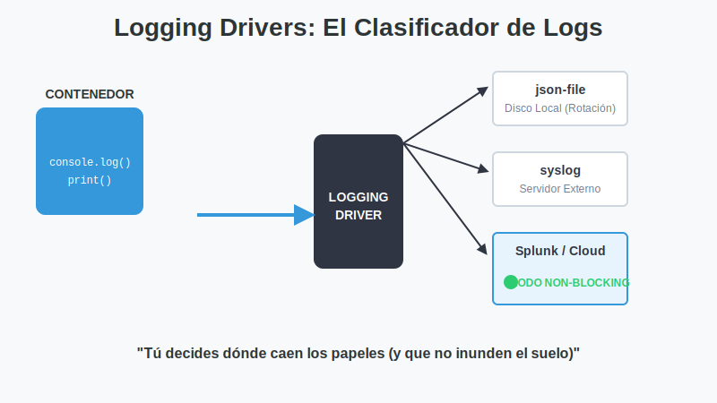
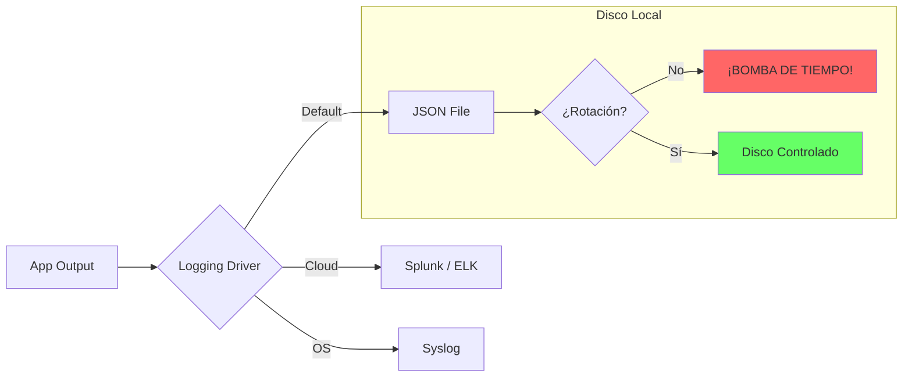

# 2. Logging Drivers

## Objetivo

Al finalizar este subtema, serás capaz de:

1.  Desactivar la "Bomba de Tiempo" que destruye servidores (Logs infinitos).
2.  Configurar la rotación automática de logs.
3.  Enviar tus logs a otro lugar (Syslog) para centralizarlos.

## Contenido Teórico

### La Bomba de Tiempo Silenciosa (JSON File)

Un día, tu servidor dirá "Disk Full" y todo se detendrá.



### Solución: Rotación de Logs (Cambiar el balde)

La rotación significa decirle a Docker:
*"Cuando el archivo llegue a 10MB, ciérralo, comprímelo y empieza uno nuevo. Y no guardes más de 3 archivos viejos".*

De esta forma, sabes que tu contenedor NUNCA ocupará más de 30MB en disco, pase lo que pase.

**Cómo configurarlo (Por Contenedor)**:
```bash
docker run -d \
  --log-opt max-size=10m \
  --log-opt max-file=3 \
  nginx
```

**Cómo configurarlo (Para Siempre)**:
Edita `/etc/docker/daemon.json`. Esto aplicará la regla a todos los contenedores nuevos. ¡Haz esto en todos tus servidores!

```json
{
  "log-driver": "json-file",
  "log-opts": {
    "max-size": "10m",
    "max-file": "3"
  }
}
```

### Otros Destinos (Drivers)

A veces no quieres guardar los logs en el disco local, sino enviarlos a un servidor central.

1.  **Syslog**: Envía los logs al sistema operativo (que luego puede reenviarlos a otro lado).
2.  **Splunk / AWS CloudWatch**: Envío directo a la nube.



**Advertencia Crítica: Blocking vs Non-Blocking**
Si configuras el driver para enviar logs a un servidor remoto (ej. Splunk) y ese servidor se cae... ¿qué hace tu app?
*   **Modo Blocking (Defecto)**: Tu app se congela esperando que Splunk responda. ¡Peligro!
*   **Modo Non-Blocking**: Tu app tira el log a un "buffer" en memoria y sigue trabajando. Si el buffer se llena, empieza a borrar logs viejos. **Usa siempre este modo en producción.**

```yaml
# Ejemplo en Compose
logging:
  driver: "splunk"
  options:
    splunk-url: "https://..."
    mode: "non-blocking"        # ¡Salva vidas!
    max-buffer-size: "4m"
```

## Paso a Paso práctico

1.  **Crear la Inundación**:
    Ejecuta esto (cuidado, escríbelo bien):
    `docker run --name spammer alpine sh -c "while true; do echo 'llenando disco...'; done"`
2.  **Ver el desastre**:
    En otra terminal, corre: `docker inspect --format='{{.LogPath}}' spammer`
    Ese es el archivo que está creciendo sin control.
3.  **Aplicar la cura**:
    Borra el contenedor y lánzalo con `--log-opt max-size=1k`.
    Ahora verás que el archivo nunca crece demasiado.

## Resumen

*   **Configura SIEMPRE la rotación de logs**. Es el error #1 de mantenimiento en Docker.
*   Si usas logging remoto, activa **non-blocking** para que tu app no muera si se cae internet.
*   `docker logs` solo funciona si usas drivers locales (`json-file` o `local`).
