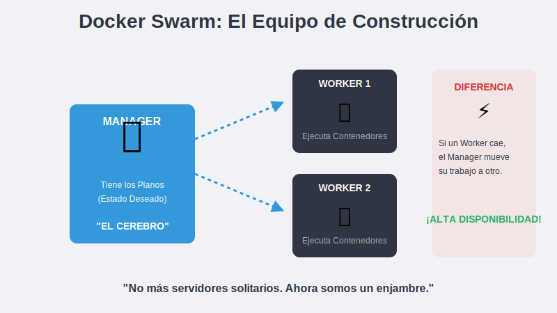
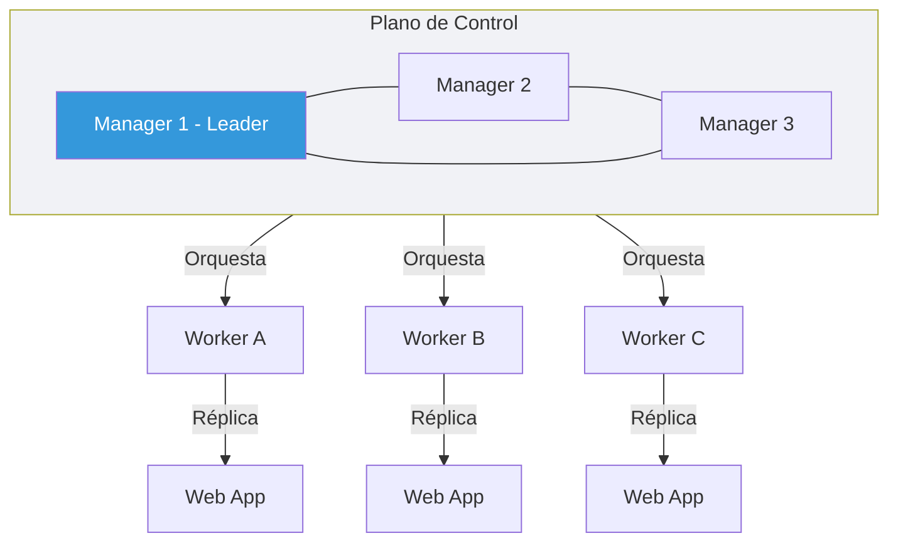

# 1. Conceptos de Cluster

## Objetivo

Al finalizar este subtema, serás capaz de:

1.  Entender qué es un "Orquestador" (y por qué Docker Compose se queda corto).
2.  Diferenciar entre Cerebros (Managers) y Músculos (Workers).
3.  Unir varias computadoras para que actúen como un solo **Super-Ordenador**.

## Contenido Teórico

### De Soldado Sencillo a Ejército (Compose vs Swarm)

Hasta ahora hemos usado **Docker Compose**. Es genial, pero está limitado a **una sola computadora**.
Si esa computadora se apaga, tu aplicación muere.

**Docker Swarm** es la solución. Convierte un grupo de servidores (físicos o virtuales) en un solo clúster.
Si un servidor explota, Swarm mueve los contenedores a otro servidor automáticamente. Tú ni te enteras.

---

### La Jerarquía: Managers y Workers

Imagina una obra en construcción.



1.  **Managers (Arquitectos / Cerebros)**:
    *   Tienen los planos (El estado deseado: "Quiero 3 réplicas de Nginx").
    *   No cargan sacos de cemento (idealmente). Su trabajo es decidir.
    *   Mantienen la base de datos distribuida y segura.

2.  **Workers (Obreros / Músculo)**:
    *   Ejecutan las tareas que les asignan los Managers.
    *   No toman decisiones. Si pierden conexión con el jefe, siguen trabajando en lo último que se les dijo hasta que alguien les diga otra cosa.

### El Algoritmo Raft (La Democracia)

Los Managers toman decisiones por votación.
Para que el clúster sobreviva, la mayoría de los managers deben estar de acuerdo.
*   **Regla de Oro**: Ten siempre un número **IMPAR** de managers (1, 3, 5).
*   *¿Por qué?*: Si tienes 2 managers y uno se cae, te quedas con el 50%. No hay mayoría (50% + 1). El clúster se bloquea.
*   Si tienes 3 managers y uno se cae, te quedan 2 (66%). ¡Hay mayoría! El clúster sigue vivo.

### La Magia del Routing Mesh (La Recepción Unificada)

Esto es lo mejor de Swarm.
Imagina que tienes 3 servidores (A, B, C).
Lanzas un contenedor web y Swarm decide ponerlo en el **Servidor C**.

¿Qué pasa si un usuario entra a la IP del **Servidor A**?
*   En el mundo antiguo: Error 404 (Ahí no hay nada).
*   **En Docker Swarm**: El Servidor A dice "Espera, yo no tengo esa web, pero sé que mi compañero C la tiene". Y redirige el tráfico internamente.

**Resultado**: Puedes entrar a la IP de CUALQUIER nodo y verás tu aplicación.

## Paso a Paso práctico

Vamos a convertir tu Docker aburrido en un Swarm Manager.

1.  **Inicializar (El Big Bang)**:
    ```bash
    docker swarm init
    ```
    *Si tienes varias IPs, Docker te pedirá especificar cuál usar con `--advertise-addr`*.

2.  **Obtener el Token**:
    Al inicializar, Docker imprimirá un comando largo:
    `docker swarm join --token SWMTKN-1-... 192.168.1.50:2377`

    Cualquier otra computadora que ejecute ese comando, se unirá automáticamente a tu clúster como Obrero.

3.  **Ver el equipo**:
    ```bash
    docker node ls
    ```
    Donde veas un asterisco `*`, ese es el nodo donde estás ahora.


## Arquitectura Swarm



## Resumen

*   **Swarm** une máquinas dispersas en un solo ente.
*   **Managers** piensan, **Workers** trabajan.
*   **Routing Mesh** te permite acceder a tu app desde cualquier nodo.
