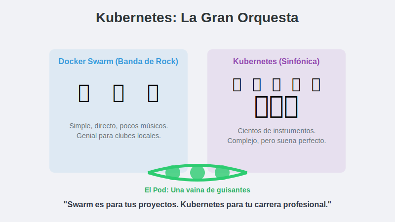
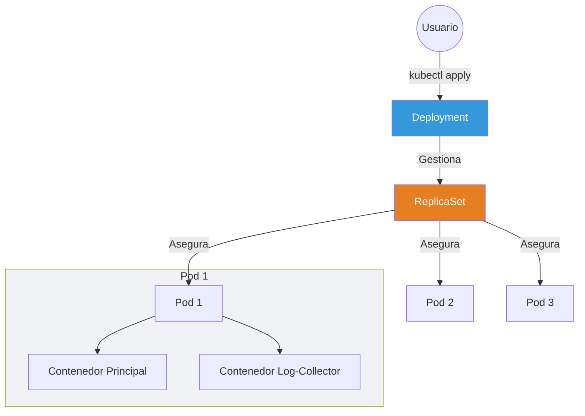

# 1. Intro a Kubernetes

## Objetivo

Al finalizar este subtema, serás capaz de:

1.  Dar el saldo de fe: De Docker Swarm a **Kubernetes**.
2.  Entender por qué Kubernetes domina el mundo (aunque sea difícil de aprender).
3.  Comprender el **Pod**: La unidad atómica de K8s.

## Contenido Teórico

### El Elefante en la Habitación (K8s)

Kubernetes (K8s) es el estándar de la industria. Lo creó Google.
Tiene mil botones, pero te lleva a cualquier lugar del mundo.

### Concepto Clave: El Pod (La Vaina)

En Docker, la unidad básica es el **Contenedor**.
En Kubernetes, la unidad básica es el **Pod**.

**¿Por qué complicarlo?**
Imagina una vaina de guisantes.
*   K8s no mueve guisantes sueltos. Mueve vainas.
*   Normalmente, **1 Vaina = 1 Guisante** (1 Pod tiene 1 Contenedor).
*   Pero a veces, necesitas meter **2 guisantes en la misma vaina** (Pattern Sidecar).
    *   Ejemplo: Tu App Web (Guisante 1) + un recolector de logs (Guisante 2).
    *   Al estar en la misma vaina, **comparten la misma dirección IP** y el mismo disco duro. Es una intimidad que Docker normal no permite.

### La Jerarquía de la Burocracia

Docker Swarm era simple ("Servicios"). Kubernetes es burocrático.

1.  **Deployment (El Gerente General)**:
    Tú hablas con él. Le dices: "Quiero la versión 2.0 de mi App". Él planifica la estrategia de actualización (Rolling Update).

2.  **ReplicaSet (El Capataz)**:
    El Gerente le ordena: "Asegúrate de que haya siempre 3 copias". El ReplicaSet solo sabe contar. Si hay 2, crea una. Si hay 4, mata una.

3.  **Pod (El Trabajador)**:
    Es quien hace el trabajo real.

Tú creas un *Deployment*. El Deployment crea un *ReplicaSet*. El ReplicaSet crea los *Pods*.

### Equivalencias Rápidas

| Si sabes Docker Swarm... | En Kubernetes se llama... |
| :--- | :--- |
| `docker service` | **Deployment** |
| Contenedor | **Pod** |
| Docker Compose YAML | **Manifiesto YAML** (Mucho más largo) |
| Manager | **Control Plane** |
| Worker | **Node** |

## Paso a Paso práctico

1.  **Activar Kubernetes**:
    En Docker Desktop (Icono de la ballena) -> Settings -> Kubernetes -> **Enable Kubernetes**.
    *Paciencia, tardará unos minutos en descargar el clúster.*

2.  **Tu primer Pod**:
    Abre la terminal y escribe:
    `kubectl run mi-primer-pod --image=nginx`

3.  **Verificar**:
    `kubectl get pods`
    Verás: `mi-primer-pod 1/1 Running`.

## Resumen

*   **Kubernetes** es complejo pero poderoso.
*   No gestionas contenedores, gestionas **Pods**.
*   **Deployment > ReplicaSet > Pod**. Esa es la cadena de mando.
