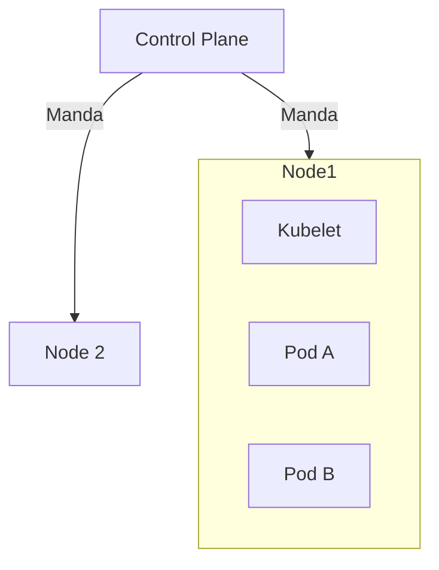

# Contenido del Subtema 1 – Pods y Nodos

## Objetivo

Al finalizar este subtema, serás capaz de:

1.  Navegar el mapa mental de Kubernetes sin perderte.
2.  Entender por qué Kubernetes envuelve los contenedores en **Pods**.
3.  Lanzar tu primera carga de trabajo en el clúster.

## Contenido Teórico

### Bienvenido a la Flota (Analogía Naval)

**Artefacto Visual: El Barco de Carga y los Camarotes**

> _Prompt para Generación_: "Illustration of a huge Cargo Ship labeled 'Worker Node' sailing on a digital sea. On deck, instead of containers, there are small cabins or rooms labeled 'Pods'. Inside one cut-away Pod, you can see a passenger labeled 'Container'. In the sky, a futuristic drone or airship labeled 'Control Plane' is beaming instructions to the ship's captain (Kubelet). K8s logo style colors (blue/white)."

La palabra _Kubernetes_ viene del griego y significa "Timonel" (el que maneja el barco). Todo aquí tiene temática naval.

1.  **El Clúster (La Flota)**: Es todo el conjunto de máquinas.
2.  **Control Plane (El Barco Almirante)**:
    - Aquí viajan los oficiales. No llevan carga. Solo toman decisiones.
    - Ellos deciden "A qué barco va esta caja".
3.  **Worker Node (El Carguero)**:
    - Son barcos grandes y tontos. Solo cargan cajas.
    - Tienen un capataz a bordo llamado **Kubelet** que recibe órdenes del Almirante.

### La Unidad Mínima: El Pod

Aquí es donde todos se confunden.
Tú crees que vas a desplegar **Contenedores**.
Pero Kubernetes dice: _"No, yo solo manejo **Pods**"_.

**¿Qué es un Pod?**
Imagina que un contenedor es **Un Pasajero**.
Un Pod es **El Camarote**.

- K8s mueve Camarotes (Pods), no pasajeros sueltos.
- Normalmente, hay **1 Pasajero por Camarote** (1 Contenedor por Pod).
- Pero a veces, metes **2 Pasajeros en el mismo Camarote** (Multi-container Pod).
  - Comparten el baño (Localhost).
  - Comparten la ventana (Dirección IP).
  - Comparten los armarios (Volúmenes).

**Regla de Vida**: Los Pods son mortales. Si un Pod muere, Kubernetes **no lo revive**. Tira el cadáver al mar y crea un pod **nuevo** (con una identidad nueva y una IP nueva) para reemplazarlo.

### ¿Por qué complicarlo tanto? (El Patrón Sidecar)

La razón de existir del Pod es permitir patrones avanzados como el **Sidecar**.
Imagina una **Moto con Sidecar**.

- **Moto (Contenedor Principal)**: Tu aplicación Web.
- **Sidecar (Contenedor Secundario)**: Un agente de seguridad que encripta el tráfico.

Kubernetes garantiza que la Moto y el Sidecar **siempre** viajen juntos, en el mismo Nodo y mueran juntos.

## Paso a Paso práctico

Vamos a usar tu `kubectl` (La radio del Almirante).

1.  **Pasar lista a los barcos**:

    ```bash
    kubectl get nodes
    ```

    _(Verás `docker-desktop` actuando como Master y Worker a la vez)._

2.  **Crear un Camarote (Pod)**:

    ```bash
    kubectl run mi-camarote --image=nginx:alpine
    ```

3.  **Ver el estado**:

    ```bash
    kubectl get pods -o wide
    ```

    _-o wide_ es importante: te dice en qué NODO aterrizó el pod y qué IP tiene.

4.  **Entrar al Camarote**:
    ```bash
    kubectl exec -it mi-camarote -- sh
    ```
    _(Estás dentro del contenedor principal del pod)._

## Diagrama de Arquitectura



## Resumen

- **Node**: La máquina física/virtual.
- **Pod**: La envoltura del contenedor. K8s solo sabe contar Pods.
- **Kubelet**: El agente en el nodo que obedece al Master.
- Nunca confíes en la IP de un Pod (es efímera).
