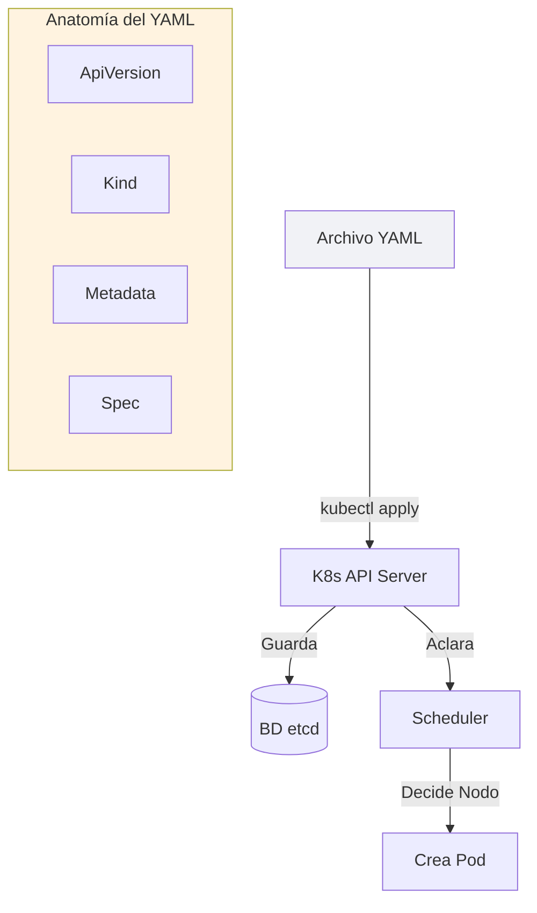

# 2. Manifiestos YAML

## Objetivo

Al finalizar este subtema, serás capaz de:

1. Escribir "Cartas a Kubernetes" (Archivos YAML).
2. Entender los 4 campos obligatorios que todo objeto tiene.
3. Usar el comando más importante de tu carrera: `kubectl apply`.

## Contenido Teórico

### Órdenes vs Deseos (Imperativo vs Declarativo)

*   **Método Antiguo (Imperativo)**: Es como cocinar.
    *"Kubernetes, descarga la imagen. Ahora crea el contenedor. Ahora abre el puerto. Ahora..."*
    Es cansado y si te saltas un paso, todo falla.

Si quieres cambiar algo, simplemente editas la carta y se la vuelves a mandar.


### Anatomía de un YAML (La Regla AKMS)

Esos archivos largos que ves en internet siempre tienen la misma estructura. Memoriza **AKMS**:

1. **ApiVersion**: La versión del formulario (como un formulario de gobierno).
   - Pods usan `v1`. Deployments usan `apps/v1`.

2. **Kind**: ¿Qué tipo de criatura es?
   - `Pod`, `Service`, `Deployment`, `ConfigMap`.

3. **Metadata**: Etiquetas para identificarlo.
   - `name`: Su DNI único.
   - `labels`: Post-its para organizarlos (`app: frontend`).

4. **Spec**: La Hoja de Especificaciones.
   - Aquí es donde dices "Quiero la imagen X", "Quiero el puerto Y".

**Ejemplo Real**:
```yaml
# A
apiVersion: v1
# K
kind: Pod
# M
metadata:
  name: pod-de-lujo
  labels:
    tipo: prueba
# S
spec:
  containers:
  - name: motor-nginx
    image: nginx:latest
```

### El Comando Sagrado: `kubectl apply`

En Docker usábamos `run`, `build`, `create`...
En Kubernetes, el 99% del tiempo usarás SOLO un comando:

*   **Si nada cambió**: No hace nada.



## Paso a Paso práctico

1.  Crea un archivo llamado `deseo.yaml` con el contenido del ejemplo de arriba.
2.  Envíaselo a Kubernetes:
    `kubectl apply -f deseo.yaml`
    Respuesta: `pod/pod-de-lujo created`.
3.  Edita el archivo: Cambia `nginx:latest` por `nginx:alpine`.
4.  Vuelve a aplicar:
    `kubectl apply -f deseo.yaml`
    Respuesta: `pod/pod-de-lujo configured`. (¡Lo actualizó!).

## Resumen

*   No des órdenes paso a paso. Describe el final.
*   Memoriza **AKMS** (ApiVersion, Kind, Metadata, Spec).
*   **`kubectl apply -f`** es tu herramienta universal.
