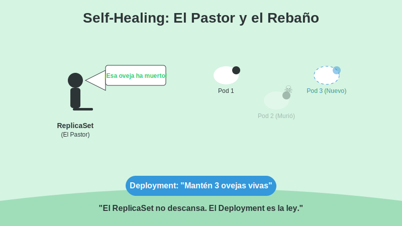

# 1. Deployments y ReplicaSets

## Objetivo

Al finalizar este subtema, serás capaz de:

1. Hacer que tu aplicación sea **Inmortal** (Self-healing).
2. Entender la jerarquía de mando en Kubernetes.
3. Usar las etiquetas (Labels) como pegamento mágico.

## Contenido Teórico

### El Problema de los Pods Sueltos

Si lanzas un Pod manual (`kubectl run`), es un **Pod Huérfano**.
Si el nodo donde vive se incendia, el Pod muere. Nadie lo llora. Nadie lo reemplaza. Tu web se cae.



Para evitar esto, usamos un sistema de gestión en capas.

---


### La Jerarquía Corporativa

**Diagrama de Jerarquía K8s**
```mermaid
graph TD
    D[Deployment (Gerente)] -->|Gestiona| RS[ReplicaSet (Supervisor)]
    RS -->|Crea/Destruye| P1[Pod 1]
    RS --> P2[Pod 2]
    RS --> P3[Pod 3]
    
    S[Service (Recepcionista)] -.->|Selector: uniforme=rojo| P1
    S -.-> P2
    S -.-> P3
```

1.  **Deployment (El Gerente General)**:
    Tú solo hablas con él.
    *"Quiero 3 copias de la Web v2.0"*.
    El Deployment es inteligente. Sabe hacer actualizaciones graduales (Rolling Updates) y volver atrás si fallan (Rollback).

2.  **ReplicaSet (El Supervisor obsesivo)**:
    Contratado por el Deployment.
    Su única misión en la vida es **contar**.
    *"El jefe quiere 3. Uno, dos... ¡falta uno! ¡CREAR NUEVO!"*
    *"El jefe quiere 3. Uno, dos, tres, cuatro... ¡sobra uno! ¡MATAR!"*
    Gracias a este obsesivo, tu aplicación se auto-repara.

3.  **Pod (El Empleado)**:
    La unidad de trabajo.

### El Pegamento Mágico: Labels y Selectors

¿Cómo sabe el Supervisor (ReplicaSet) qué Pods son suyos?
No usa una lista de nombres. Usa **Uniformes (Labels)**.

En el archivo YAML verás esto repetido:

```yaml
selector:
  matchLabels:
    app: mi-tienda   # "Busca a cualquiera con uniforme 'mi-tienda'"
template:
  metadata:
    labels:
      app: mi-tienda # "Ponle uniforme 'mi-tienda' a los nuevos"
```

El ReplicaSet escanea el clúster constantemente buscando chicos con el uniforme `app: mi-tienda`.
*   Si encuentra pocos, contrata más.
*   Si encuentra muchos, despide.

*(Truco divertido: Si le quitas la etiqueta a un Pod en vivo, el ReplicaSet deja de verlo y crea otro nuevo. ¡El Pod original queda huérfano pero vivo!)*

## Paso a Paso práctico

Vamos a crear un Deployment Inmortal.

1.  **Crear el YAML (`jefe.yaml`)**:
    ```yaml
    apiVersion: apps/v1
    kind: Deployment
    metadata:
      name: empresa-inmortal
    spec:
      replicas: 3
      selector:
        matchLabels:
          uniforme: rojo
      template:
        metadata:
          labels:
            uniforme: rojo
        spec:
          containers:
          - name: trabajador
            image: nginx
    ```

2.  **Contratar**:
    `kubectl apply -f jefe.yaml`

3.  **Verificar**:
    `kubectl get pods` (Verás 3).

4.  **Intento de Asesinato**:
    Copia el nombre de uno de los pods y elimínalo:
    `kubectl delete pod empresa-inmortal-xxxx`

5.  **Resurección**:
    Ejecuta `kubectl get pods` inmediatamente.
    Verás que el pod viejo está `Terminating` y uno NUEVO ya está `Running` o `ContainerCreating`.
    ¡El sistema se curó solo!

## Resumen

*   Nunca uses Pods sueltos. Usa **Deployments**.
*   El **ReplicaSet** asegura que siempre haya N copias.
*   Los **Labels** conectan al Supervisor con los Trabajadores.
