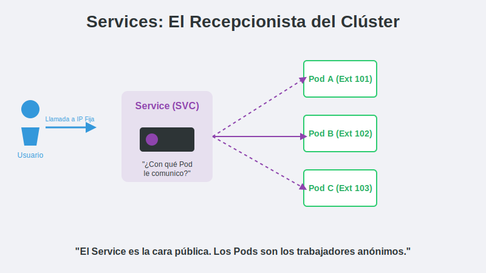

# 2. Services y Networking

## Objetivo
Al finalizar este subtema, serás capaz de:

1. Comprender por qué las IPs de los Pods no son confiables.
2. Utilizar el objeto **Service** para ofrecer una IP estable y balanceo de carga.
3. Diferenciar entre **ClusterIP**, **NodePort** y **LoadBalancer**.

## Contenido Teórico

Necesitamos una "Dirección Fija" que nunca cambie, independientemente de qué Pods estén vivos.



### 2️⃣ La Solución: Service (SVC)
Un **Service** es una abstracción que define un conjunto lógico de Pods y una política para acceder a ellos.
1. **ClusterIP** (Default): Solo accesible *desde dentro* del clúster. Ideal para bases de datos o backends internos.

2. **NodePort**: Abre un puerto estático (ej. 30007) en *todos* los nodos del clúster. Permite acceso externo básico (`IP_NODO:PUERTO`).

3. **LoadBalancer**: Pide a tu proveedor de nube (AWS, Azure, GCP) un Balanceador de Carga real con IP pública. (En local, Docker Desktop simula esto en `localhost`).

```mermaid
sequenceDiagram
    participant User as Usuario (Browser)
    participant SVC as Service (LoadBalancer)
    participant P1 as Pod A
    participant P2 as Pod B
    
    User->>SVC: Acceso a http://mi-app
    Note over SVC: Balanceo de Carga (Round Robin)
    SVC-->>P1. Redirección de tráffico
    P1-->>User: Respuesta de App
    
    User->>SVC: Acceso de nuevo
    SVC-->>P2: Redirección a otro Pod
    P2-->>User: Respuesta de App
```

### 4️⃣ Manifiesto de un Service
```yaml
apiVersion: v1
kind: Service
metadata:
  name: mi-servicio
spec:
  selector:
    app: nginx-demo       # ¡Apunta a los Pods con esta etiqueta!
  ports:
  - protocol: TCP
    port: 80              # Puerto del Servicio
    targetPort: 80        # Puerto del Pod
  type: LoadBalancer      # Tipo de exposición
```

## Paso a Paso práctico
1.  Tener un Deployment corriendo (ej. `nginx-deployment`).
2.  Crear `service.yaml`.
3.  Aplicar: `kubectl apply -f service.yaml`.
4.  Verificar IP externa: `kubectl get svc`.
5.  Acceder desde el navegador.

## Resumen
*   **Pods**: IPs efímeras.
*   **Services**: IPs estables y DNS interno (`http://mi-servicio`).
*   **Selector**: El pegamento que une al Service con sus Pods.
